[](assets/hero.svg)

# pork

[](https://github.com/abraira85/pork/actions/workflows/ci.yml)
[](https://go.dev/dl/)
[](LICENSE)
[](https://github.com/abraira85/pork/releases)
[](CONTRIBUTING.md)

> A tiny terminal tool to inspect, visualize and free local ports.
>
> Stop fighting with `lsof`, `ss`, `netstat` and random `kill` commands. Pork is a modern, cross-platform alternative that gives you clear, visual answers.

## `~ ❯ man pork`

```
NAME
    pork — inspect, visualize and free local ports

SYNOPSIS
    pork [command] [port]

DESCRIPTION
    Pork is a tiny terminal tool to inspect, visualize and free local ports.
    It provides a beautiful and simple interface over standard tools like
    lsof or netstat.

COMMANDS
    pork <port>     inspect a single port
    pork list       show every listening port in a table
    pork kill       free a port, safely
    pork free       find the next available port
    pork range      visual map of a port range
    pork shell      interactive TUI

OPTIONS
    --help          show help
```

## `~ ❯ pork 3000`

Inspect a port and see exactly which process is holding it:

```bash
pork 3000
```

*Output:*

```
Error: Port 3000 is busy

  PID       18422
  Process   node
  User      rober
  Command   npm run dev
  Address   127.0.0.1:3000
  Protocol  TCP
  Status    LISTEN
```

If the port is free:

```
🐷 Port 3000 is free
```

Nothing to install, nothing to parse — the answer is right there.

## `~ ❯ pork list`

Show all ports currently listening, in a clean table:

```bash
pork list
```

*Output:*

```
╭───────┬─────────┬───────────────────────────╮
│ PORT  │ PID     │ PROGRAM                   │
├───────┼─────────┼───────────────────────────┤
│ 3000  │ 18422   │ node                      │
│ 5432  │ -       │ Unknown (requires sudo)   │
│ 6379  │ -       │ Unknown (requires sudo)   │
│ 8080  │ 11248   │ go run ./main.go          │
╰───────┴─────────┴───────────────────────────╯
```

Processes you can't read without elevated permissions are flagged so you know why the cell is empty.

## `~ ❯ pork kill 3000`

Free a port without accidentally nuking something important:

```bash
pork kill 3000
```

Pork finds the process occupying the port, asks for confirmation, and refuses
to touch critical system processes.

```
🐷 Port 3000 is used by node PID 18422
Command:
npm run dev

Kill process? [y/N]: y
🐷 Freed port 3000
Killed node process PID 18422
```

Terminal applications are usually harmless. Something like `sshd` or a container
runtime triggers a second, extra-visible warning before you're allowed to remove it.

## `~ ❯ pork free 3000`

Need a port that's actually free? Pork scans upwards until it finds one:

```bash
pork free 3000
```

*Output (when the port is busy):*

```
Error: Port 3000 is busy
🐷 Next free port: 3001
```

## `~ ❯ pork range 3000 3010`

See the whole neighbourhood at a glance:

```bash
pork range 3000 3010
```

*Output:*

```
🐷 Pork range scan

3000  ● busy   node           PID 18422
3001  ○ free
3002  ○ free
3003  ○ free
3004  ○ free
3005  ● busy   nginx          PID 9811
3006  ○ free
3007  ○ free
3008  ○ free
3009  ○ free
3010  ● busy   redis-server   PID 10504

● busy   ○ free

🐷 Next free port: 3001
```

## `~ ❯ pork shell`

Prefer browsing? Launch the interactive TUI:

```bash
pork shell
```

A full-screen terminal interface to browse, inspect, and kill processes
occupying local ports — keyboard driven, no flags to remember.

## `~ ❯ man install`

### Pre-built binaries

Grab the latest release for your platform from the
[releases page](https://github.com/abraira85/pork/releases).

### Go install

```bash
go install github.com/outboss/pork@latest
```

### From source

```bash
git clone https://github.com/abraira85/pork.git
cd pork
make build

./bin/pork 3000
```

Requires Go 1.25+.

## `~ ❯ make build`

```bash
make build        # compile into bin/pork
make test         # run all tests
make lint         # golangci-lint
make vet          # go vet
make clean        # remove build artifacts
```

Development setup is in [`CONTRIBUTING.md`](CONTRIBUTING.md). All checks above
run automatically in CI on every pull request.

## `~ ❯ roadmap`

- [x] **v0.1.0** — Core CLI: inspect, list, kill, free, range.
- [ ] **v0.2.0** — Advanced filtering (`--json`, `--process`), `--force`, `--yes`.
- [ ] **v0.3.0** — Real-time `watch` mode and a richer `pork shell` TUI.
- [ ] **v1.0.0** — Stable cross-platform releases, automated binaries, full docs.

## `~ ❯ man contributing`

Contributions are welcome. Start with [`CONTRIBUTING.md`](CONTRIBUTING.md) for
the workflow, [`CODE_OF_CONDUCT.md`](CODE_OF_CONDUCT.md) for how we treat each
other, and [`SECURITY.md`](SECURITY.md) if what you found is a security issue
rather than a bug. Everyone who lands a change gets listed in
[`CONTRIBUTORS.md`](CONTRIBUTORS.md).

Releases follow [Semantic Versioning](https://semver.org/) and are tracked in
[`CHANGELOG.md`](CHANGELOG.md).

## `~ ❯ whoami`

Built by [Rober de Ávila Abraira](https://github.com/abraira85) —
[outboss.io](https://outboss.io)

## License

MIT — see [LICENSE](LICENSE).